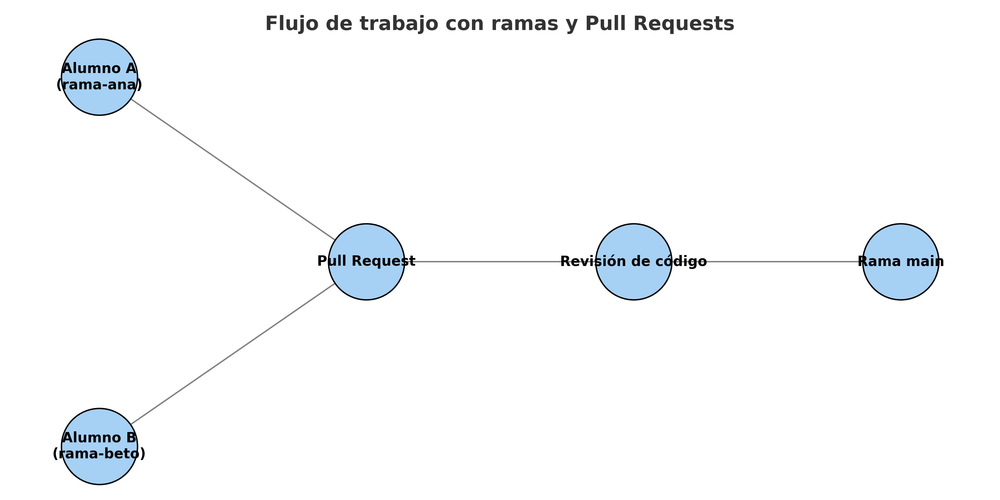

---

# 🚀 **Ejercicio: Trabajo en ramas con Git**

📌 **Objetivo:** aprender a clonar un repositorio existente, crear una rama propia y trabajar sin tocar la rama `main`.

---

## **1. Descargar el repositorio (clonar)**

1. Asegúrate de que tienes Git instalado y acceso a Internet.
2. En VS Code o Git Bash, ve a la carpeta donde quieras guardar el proyecto.
3. Ejecuta:

   ```bash
   git clone https://github.com/Amagozz/LM20252026.git
   ```
4. Entra en la carpeta descargada:

   ```bash
   cd LM20252026
   ```

---

## **2. Crear tu propia rama**

Cada alumno debe trabajar en **su propia rama**.

1. Asegúrate de estar en `main`:

   ```bash
   git checkout main
   ```
2. Descarga los últimos cambios (por si hay actualizaciones):

   ```bash
   git pull origin main
   ```
3. Crea una rama nueva con tu nombre o alias:

   ```bash
   git checkout -b rama-tu-nombre
   ```

   Ejemplo:

   ```bash
   git checkout -b rama-ana
   ```

---

## **3. Trabajar en tu rama**

1. Edita o crea archivos (ej. `index.html`).
2. Guarda cambios y confírmalos:

   ```bash
   git add .
   git commit -m "Añadido ejercicio en mi rama"
   ```
3. Sube tu rama a GitHub:

   ```bash
   git push -u origin rama-tu-nombre
   ```

---

## **4. Nunca hacer push en `main`**

⚠️ Muy importante:

* **No hagas commits ni pushes directamente en `main`.**
* `main` debe permanecer limpio como rama principal.
* Siempre trabajad en vuestra rama y, si hace falta, pedid un **Pull Request** para fusionar.

---

## **5. Ver ramas y moverse entre ellas**

* Listar todas las ramas:

  ```bash
  git branch
  ```
* Cambiar a otra rama:

  ```bash
  git checkout rama-tu-nombre
  ```

---

✅ **Resultado esperado:**

* Cada alumno tiene una copia del repositorio.
* Cada uno trabaja en **su propia rama**, nunca en `main`.
* Pueden subir sus avances sin interferir en el trabajo de los demás.

---

Perfecto, entonces te preparo un **ejercicio final de colaboración en GitHub** con **Pull Requests (PRs)** para que tu alumnado entrene el flujo de trabajo en equipo.

---

# 🤝 **Ejercicio: Trabajo colaborativo con Pull Requests**

📌 **Objetivo:** practicar cómo subir cambios desde una rama personal y pedir que otro compañero los revise antes de integrarlos en `main`.

---

## **1. Preparación (cada alumnx)**

1. Haber clonado el repositorio central:

   ```bash
   git clone https://github.com/Amagozz/LM20252026.git
   cd LM20252026
   ```
2. Crear su propia rama (ejemplo con el nombre de cada alumno):

   ```bash
   git checkout -b rama-ana
   ```

---

## **2. Hacer cambios en su rama**

1. Crear o modificar un archivo (ej. `ejercicio-ana.html`).
2. Guardar cambios, añadir y confirmar:

   ```bash
   git add .
   git commit -m "Añadido ejercicio de Ana"
   ```
3. Subir la rama a GitHub:

   ```bash
   git push -u origin rama-ana
   ```

---

## **3. Abrir un Pull Request en GitHub**

1. Entrar en el repositorio en GitHub.
2. Verás un mensaje tipo: *“rama-ana has recent pushes, compare & pull request”*.
3. Pulsar **Compare & Pull Request**.
4. Escribir una descripción clara (qué has añadido, por qué).
5. Enviar el Pull Request.

---

## **4. Revisar el Pull Request (otro alumno)**

1. Otro compañero entra en GitHub, pestaña **Pull Requests**.
2. Selecciona el PR de su compañero.
3. Revisa los archivos modificados: pestaña **Files changed**.

   * Puede hacer comentarios línea por línea.
   * Puede aprobar o pedir cambios.
4. Si está correcto, pulsa **Merge pull request** (si tienen permiso).

---

## **5. Mantener `main` limpio**

* Después de fusionar, todos los alumnos deben actualizar su rama `main` local:

  ```bash
  git checkout main
  git pull origin main
  ```
* Luego pueden volver a su rama personal o crear una nueva rama para el siguiente ejercicio.

---

## **6. Resultado esperado**

* Cada alumno sube sus aportaciones **en una rama independiente**.
* Otro compañero revisa y aprueba el Pull Request.
* Nadie trabaja directamente sobre `main`.

---

👉 Esto simula un flujo profesional:

* **Desarrollador A** → crea una nueva función en su rama.
* **Desarrollador B** → revisa y aprueba el código antes de integrarlo en `main`.

---

Aquí tienes un **diagrama visual** del flujo de trabajo con ramas y *Pull Requests*:

* Cada alumno trabaja en su propia rama (`rama-ana`, `rama-beto`, etc.).
* Suben sus cambios y crean un **Pull Request**.
* Otro compañero hace la **revisión de código**.
* Finalmente, los cambios aprobados pasan a la **rama main**.


